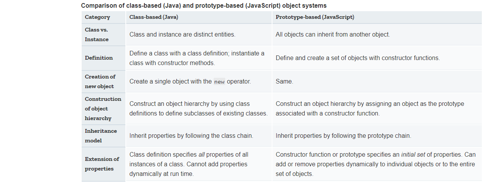

# Details of the Object Model

JavaScript is an object-based language based on prototypes, rather than being class-based. Because of this different basis, it can be less apparent how JavaScript allows you to create hierarchies of objects and to have inheritence of properties and their values.

## Class-based vs. prototype-based languages

Class-based object-oriented languages, such as Java and C++ are founded on the concept of two distinct entities: classes and instances.

- A class defines all of the properties that characterize a certain set of objects. A class is abstract rather than any particular memeber in aset of objects it describes.
- An instance, on the other hand, is the instantiation of a class; that is, one of its members. Aninstance has excatly the same properties of its parent class(no more, no less)

A prototype-based language such as JavaScipt, does not make this distinction: it simply has objects. A prototype-based language has the notion of a prototypical object, an object used as a template from which to get the initial properties for a new object. Any object can specify its own properties, either when you create it or at run time. In addition, any object can be associated as the prototype of another object, allowing the second object to share the first object's properties.

## Defining a class

In class-based languages, you define a class in a separate class definition. In that definition you can specify special methods, called constructors, to create instances of the class. A constructor method can specify initial values for the instance's properties and perform other processing appropriate at creation time. You use the new operator in association with the constructor method to create class instances.

JavaScript follows a similar model, but does not have a class definition separate from the constructor. Instead, you define a constructor function to create objects with a particular initial set of properties and values. Any JavaScript function can be used as a constructor. You use the new operator with a constructor function to create a new object.

## Subclasses and inheritence

In a class-based language, you create a hierarchy of classes through the class definitions. In a class definition, you can specify that the new class is a subclass of an already existing class. The subclass inherits all the properties of the superclass and additionally can add new properties or modify the inherited ones. For example, assume the Employee class includes only the name and dept properties, and Manager is a subclass of Employee that adds the reports property. In this case, an instance of the Manager class would have all three properties: name, dept, and reports.

JavaScript implements inheritance by allowing you to associate a prototypical object with any constructor function. So, you can create exactly the Employee — Manager example, but you use slightly different terminology. First you define the Employee constructor function, specifying the name and dept properties. Next, you define the Manager constructor function, calling the Employee constructor and specifying the reports property. Finally, you assign a new object derived from Employee.prototype as the prototype for the Manager constructor function. Then, when you create a new Manager, it inherits the name and dept properties from the Employee object.

## Adding and removing properties

In class-based languages, you typically create a class at compile time and then you instantiate instances of the class either at compile time or at run time. You cannot change the number or the type of properties of a class after you define the class. In JavaScript, however, at run time you can add or remove properties of any object. If you add a property to an object that is used as the prototype for a set of objects, the objects for which it is the prototype also get the new property.



The term instance has a specific technical meaning in class-based languages. In these languages, an instance is an individual instantiation of a class and is fundamentally different from a class. In JavaScript, "instance" does not have this technical meaning because JavaScript does not have this difference between classes and instances. However, in talking about JavaScript, "instance" can be used informally to mean an object created using a particular constructor function. So, in this example, you could informally say that jane is an instance of Engineer. Similarly, although the terms parent, child, ancestor, and descendant do not have formal meanings in JavaScript; you can use them informally to refer to objects higher or lower in the prototype chain.

## Inheriting Properties

Suppose you create the `mark` object as a `WorkerBee` with the following statement:

```JavaScript

var mark = new WorkerBee;

```

When JavaScript sees the `new` operator, it creates a new generic object and implicitly sets the value of the internal property [[Prototype]] to the value of `WorkerBee.prototype` and passes this new object as the value of the this keword to the WorkerBee constructor function. The internal [[Prototype]] property determines the prototype chain used to return property values. Once these properties are set, JavaScript returns the new object and the assignment statement sets the variable `mark` to that object.

This process does not explicitly put values in the mark object (local values) for the properties that mark inherits from the prototype chain. When you ask for the value of a property, JavaScript first checks to see if the value exists in that object. If it does, that value is returned. If the value is not there locally, JavaScript checks the prototype chain (using the internal [[Prototype]] property). If an object in the prototype chain has a value for the property, that value is returned. If no such property is found, JavaScript says the object does not have the property.

In JavaScript, you can add properties to any object at run time. You are not constrained to use only the properties provided by the constructor function.

If you add a new property to an object that is being used as the prototype for a constructor function, you add that property to all objects that inherit properties from the prototype.

Notice that with these definitions, you cannot specify an initial value for an inherited property such as name. If you want to specify an initial value for inherited properties in JavaScript, you need to add more code to the constructor function.

So far, the constructor function has created a generic object and then specified local properties and values for the new object. You can have the constructor add more properties by directly calling the constructor function for an object higher in the prototype chain.

## Property inheritence revisited

### Local versus inherited values
When you access an object property, JavaScript performs these steps
- Check to see if the value exists locally. If it does, return the value
- If there is not a local value, check the prototype chain(usinf the __proto__ property)
- If an object in the prototype has a value for the specified property, return that value
- If nos such property is found, the object does not have the property

If you want to change the value of an object property at run time and have the new value be inherited by all descendants of the object, you cannot define the property in the object's constructor function. Instead, you add it to the constructor's associated prototype

### Determingin instance relationship

Property lookup in JavaScript looks within an object's own properties and, if the property name is not found, it looks within the special object property __proto__. this continues recursively; the process in called "lookup in the prototype chain".

The special property __proto__ is set when an object is constructed; it is set to the value of the constructor's prototype property. So the expression `new Foo()` creates an object with `__proto__ == Foo.prototype`. Consequently, changes to the properties of Foo.prototype alters the property lookup for all objects that were created by `new Foo()`.

Every object has a __proto__ object property(except Object); every function has a `prototype` object property. So objects can be related by `prototype inheritence` to other objects. You can test for inheritence by comparing an object's __proto__ to a function's prototype object. JavaScript provides a shortcut: the `instanceof` operator tests an object against a function and returns true if the object inherits from the function prototype.

### Global information in constructors
When you create constructors, you need to be careful if you set global informatino in the constructor.

### No multiple inheritence
Some object-oriented languages allow multiple inheritence. That is, an object can inherit the properties and values from unrelated parent objects. JavaScript does not support multiple inheritence.

Inheritence of property values occurs at run time by JavaScrit searching the prototype chain of an object to find a value. Because an object has a single associated prototype, JavaScript cannot dynamically inherit from more than one prototype chain.

In JavaScript, you can have a constructor function call more than one other constructor function within it. This gives the illusion of multiple inheritence.